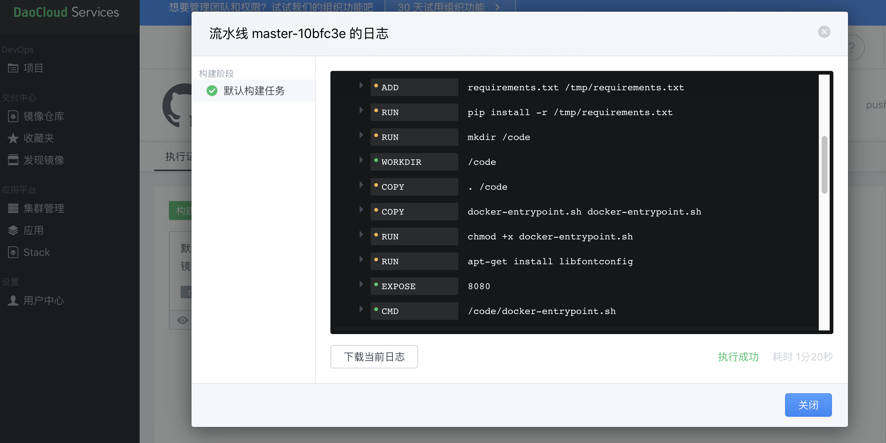
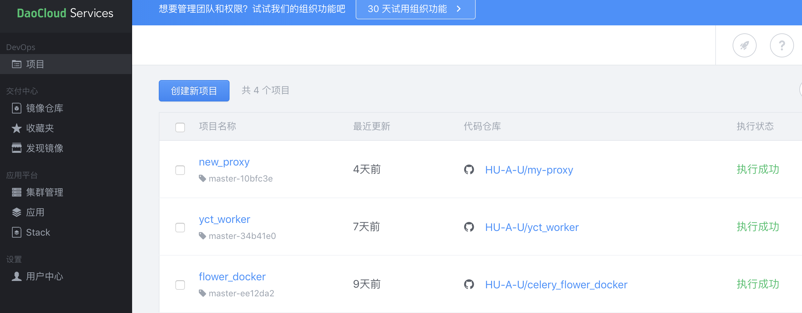
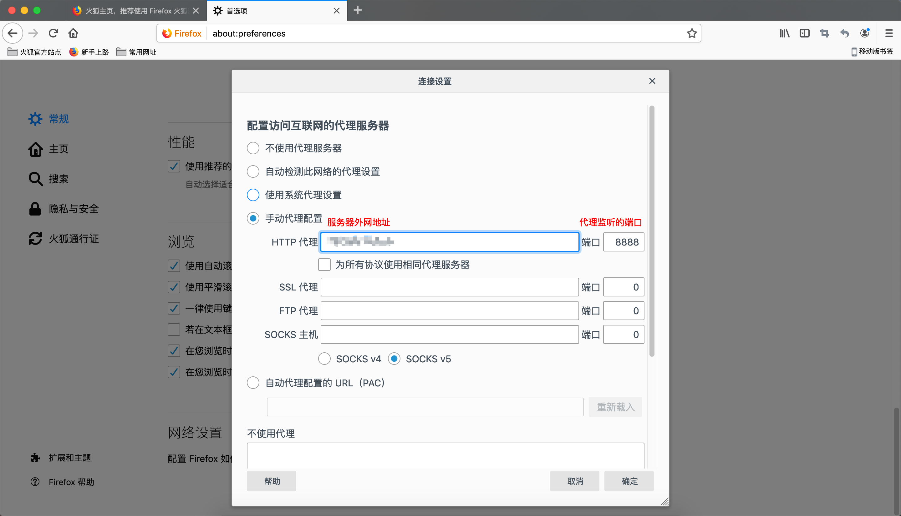
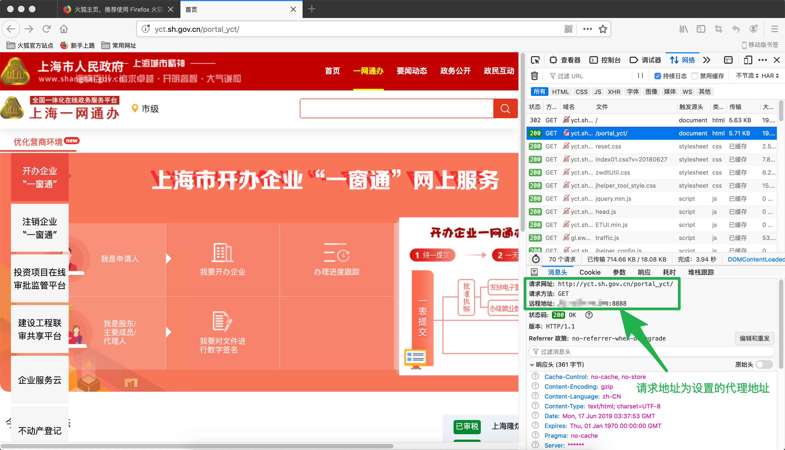
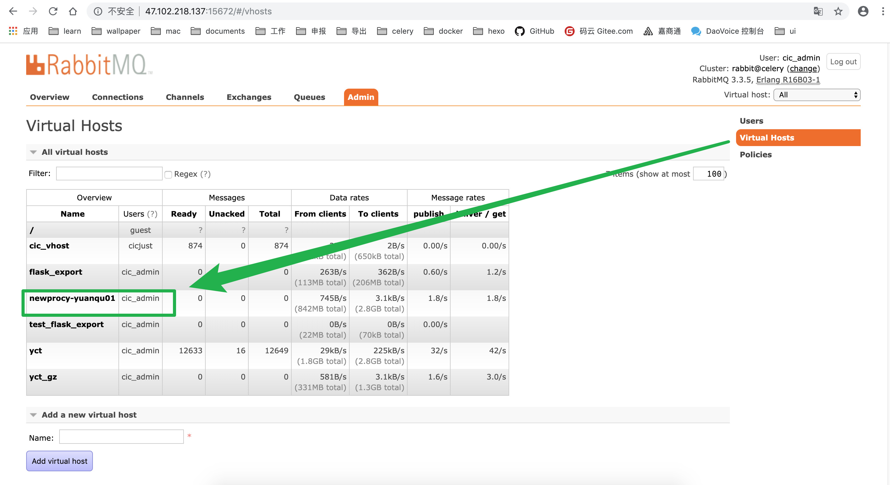

### 概述

本文只是关于在docker中运行mitmproxy和celery的过程；

#### 需求

使用mitmproxy做中间人代理获取网站的请求和响应，以及使用
celery worker 对截取的请求进行过滤解析后存库

##### 使用docker的原因

1.最初的本地开发环境是Windows系统，由于celery的某些版本对Windows不支持，所以会出现不兼容的问题，最后找到celery==4.3.0rc1版本，同时安装mitmproxy和celery成功.
2.当我在服务器(ubuntu16.04)上使用虚拟环境安装环境依赖的时候，安装mitmproxy一直安装失败，好像是关于系统编译的一些报错，mitmproxy只支持python3.6以上版本，查询无果，最后放弃。

使用docker最主要的就是隔离性，轻量化，版本控制，迁移比较方便

#### 版本

mitmproxy==4.0.4

celery==4.3.0rc1

### 编写dockerfile

分别打包两个镜像，一个镜像运行proxy容器，一个镜像运行celery的worker
> 关于dockerfile的语法,参考<https://www.cnblogs.com/lienhua34/p/5170335.html>

#### proxy镜像

首先创建Dockerfile文件，没有后缀，注意文件名首字母D大写，因为踩过坑

```
FROM python:3.7 
ADD requirements.txt /tmp/requirements.txt
RUN pip install -r /tmp/requirements.txt
RUN mkdir /code
WORKDIR /code
COPY . /code
COPY docker-entrypoint.sh docker-entrypoint.sh
RUN chmod +x docker-entrypoint.sh
RUN apt-get install libfontconfig

EXPOSE 8080

CMD /code/docker-entrypoint.sh
```
使用EXPOSE命令将容器的运行端口8080暴露出来
使用CMD命令运行docker-entrypoint.sh启动文件，内容如下:

```
/usr/local/bin/mitmdump -s /code/start_script.py
```
如果不加 /usr/local/bin/ 路径会找不到 mitmdump


##### 创建镜像

我使用的是daocloud平台打包镜像，比较方便，关联GitHub仓库就可以直接打包，有新的提交就会自动重新打包一个版本

执行日志

打包的项目


拉取打包好的镜像
```
docker pull [镜像]
```

启动容器
```
celery run --name my_proxy -p 8888:8080 -d <镜像名称>
```

使用 -p 参数进行端口映射，将容器暴露的8080端口映射到宿主机的8888端口


查看运行状态,是否正常启动
```
[root@procy ~]# docker ps -a
CONTAINER ID        IMAGE                   COMMAND                  CREATED             STATUS              PORTS                    NAMES
b5af5afc3d74        daocloud.io...:latest   "/bin/sh -c /code/do…"   3 seconds ago       Up 3 seconds        0.0.0.0:8888->8080/tcp   my_proxy
```
看到status为up，并且已经映射到8888端口

查看日志,容器内部监听8080端口
```
[root@procy ~]# docker logs my_proxy
Loading script /code/start_script.py
Proxy server listening at http://*:8080
```

#### 代理运行成功后设置代理
在浏览器中设置代理地址，一般使用火狐，设置代理地址为服务的地址，在8888端口


随便打开一个网页，可以看到请求地址为所设置的代理地址


使用 docker logs my_proxy
看到日志的输出一大堆，找到你访问的那一条URL就说明代理成功了
```
180.165.231.56:57424: GET http://addons.g-fox.cn/ntab.gif?c=ntab&t=timing&a=1-o-idb&d=73&f=&r=0.8194234211953002&cid=firefox.com.cn
                   << 200 OK 800b
180.165.231.56:57426: GET http://addons.g-fox.cn/ntab.gif?c=ntab&t=timing&a=1-o-cursor&d=80&f=&r=0.9766453266846722&cid=firefox.com.cn
                   << 200 OK 800b
```

#### celery镜像
环境依赖与proxy镜像的相同，只是运行的启动命令不同；
因为这里的数据解析任务我是分为三个队列去执行，这样异步执行可以减少数据处理的时间，相互独立，失败的任务不会影响到其他的任务
1.第一个队列create里的任务只是简单的将mitmproxy传递过来的原始pickle后的请求以及响应的对象暂存到redis中，并设置过期时间，然后异步调用analysis队列
2.第二个队列analysis里的任务是解析pickle前的request对象和response对象，获取需要的内容，再异步调用save队列
3.第三个队列save主要是将解析后的数据更新到mysql中，以供页面回显。

celery Dockerfile内容如下：

```
FROM python:3.7
ADD requirements.txt /tmp/requirements.txt
RUN pip install -r /tmp/requirements.txt
RUN mkdir /code
WORKDIR /code
COPY . /code
COPY docker-entrypoint.sh docker-entrypoint.sh
RUN chmod +x docker-entrypoint.sh
RUN apt-get install libfontconfig

ENV C_QUEUE to_create
ENV A_QUEUE to_analysis
ENV S_QUEUE to_save
ENV QUEUE to_create

CMD /code/docker-entrypoint.sh
```
docker-entrypoint.sh执行文件内容如下：
```
#!/bin/sh
set -e

if [ "$QUEUE" = "$C_QUEUE" ]; then
	celery -A handle_data.celery_app worker -l info -Q to_create --uid 13
elif [ "$QUEUE" = "$A_QUEUE" ]; then
	celery -A handle_data.celery_app worker -l info -Q to_analysis --uid 13
elif [ "$QUEUE" = "$S_QUEUE" ]; then
	celery -A handle_data.celery_app worker -l info -Q to_save --uid 13
else
	exit 1
fi
```

dockerfile中的 ENV 指定环境变量,通过.sh文件判断启动命令里的参数，to_create,to_analysis,to_save 三个队列，指定到不同的消息队列

启动命令是
```
docker run --name to_create --link yct_redis:aliyun_redis -e QUEUE=to_create -d [镜像名称]
docker run --name to_analysis --link yct_redis:aliyun_redis -e QUEUE=to_analysis -d [镜像名称]
docker run --name to_save --link yct_redis:aliyun_redis -e QUEUE=to_save -d [镜像名称]
```
--name 启动容器名称

--link 是关联redis容器，作为数据缓存

-e 参数后面 指定 QUEUE 为 to_create 队列

-d 守护进程运行

启动三个容器，进行数据解析和存库

### 迁移到阿里云
由于客户量增多，需要将服务从我们的服务器扩展到阿里云上, 由于解析后的数据需要放到自己本地的数据库里；

1.在RabbitMQ上新建一个vhost,存放阿里云代理扔出的任务消息,此处是 newproxy-yuanqu01；

RabbitMQ是运行阿里云上的另一台服务器，地址为 47.102.218.137:5672


2.先运行proxy代理，关联到docker redis 容器
```
docker run --name yct_proxy --link yct_redis:aliyun_redis -p 8888:8080 -d [镜像名称]
```

3.运行celery worker，读取到rabbitMQ中的任务消息去执行,进行数据截取，解析 
```
docker run --name to_create --link yct_redis:aliyun_redis -e QUEUE=to_create -d [镜像名称]
docker run --name to_analysis --link yct_redis:aliyun_redis -e QUEUE=to_analysis -d [镜像名称]
```

4.由于解析后的数据是要存到我们自己的服务器数据库中，所以就要将数据存储的服务部署到自己的服务器上
使用同样的yct_worker镜像，连接到阿里云的RabbitMQ，订阅to_save消息队列里的内容，将数据存储到正式环境数据库中
```
docker run --name to_save --link yct_redis:aliyun_redis -e QUEUE=to_save -d [镜像名称]
```
