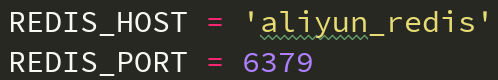

### 概述
由于业务需要，需要将现有的服务迁移到阿里云上，该服务使用容器运行，外部需要连接一个redis进行暂存数据；
所以使用另一个容器运行一个redis，本文就是关于现有容器服务互联到另外一个redis容器，其他数据库mysql等也是类似的做法。

#### 环境
CentOS 7.6

### 下载redis镜像
在 DockerHub <https://hub.docker.com/_/redis>
```
docker pull redis
```

### 运行redis镜像
由于是容器之间的互联，所以就不做端口映射，redis容器默认运行在6379端口
启动命令如下：
```
docker run --name [redis容器名称] -d [镜像名]
```

### 修改服务中的redis的连接地址
修改我的已有服务配置文件中的redis地址


### 使用--link参数连接redis

```
docker run --name test_proxy --link [redis容器名称]:aliyun_redis -p 8888:8080 -d [服务镜像]
```
其中 --link 后面冒号左右两边分别代表 已在运行的redis容器名称或id 和 服务里的redis地址名称；
直接将正在运行的redis服务映射到服务里面的redis地址.

